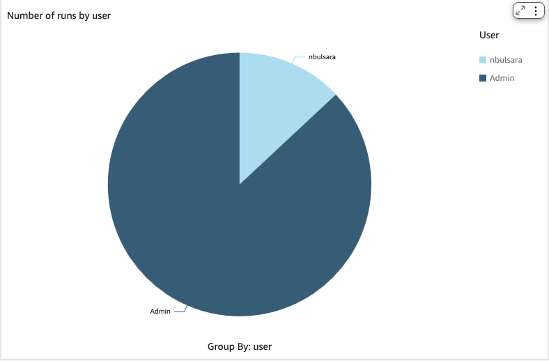
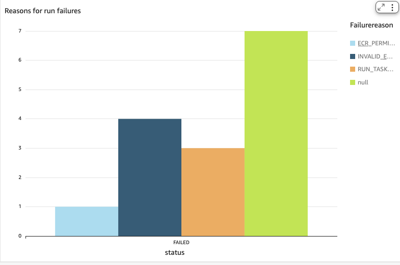
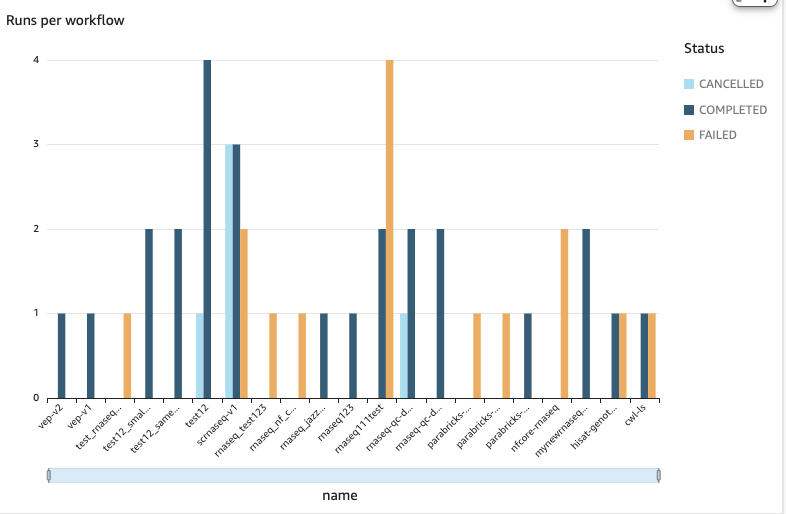
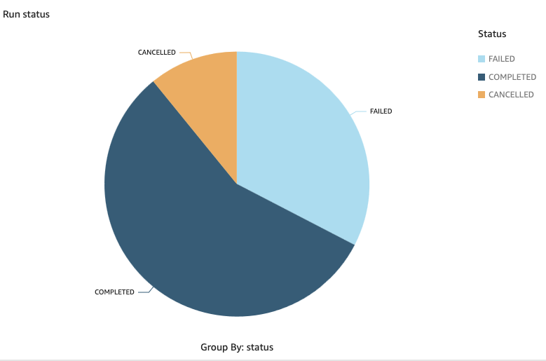
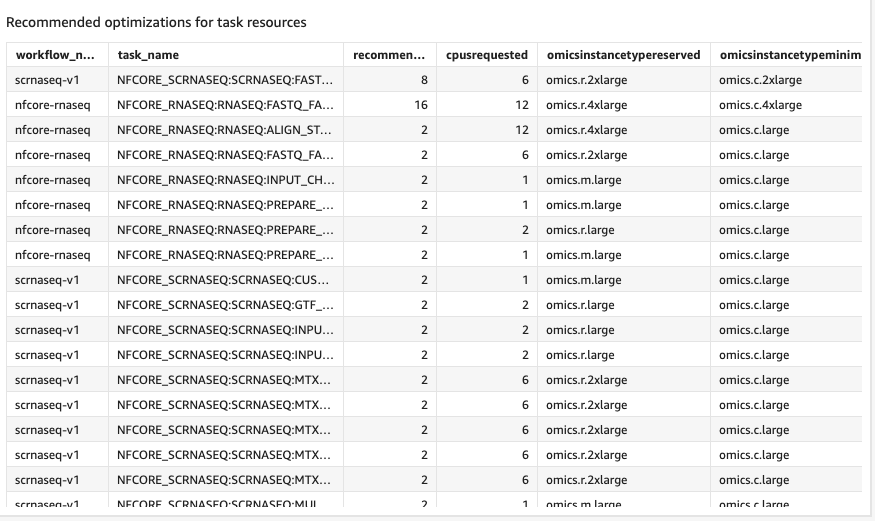

# How to create Quicksight dashboards from the Healthomics Workflows Datalake

The healthomics-workflow-datalake database can be queried from Amazon Athena and has the following tables:

1. run_analyzer_output - run_analyzer utility outputs
2. run_status_change_event - run event changes from EventBridge
3. runs - run details
4. tasks - task details
5. workflow_records - workflow details

Before going to Quicksight, we will create a View that provides useful information about potential task optimizations as suggested by run_analyzer. 

```
CREATE OR REPLACE VIEW "run_task_optimizations" AS 
SELECT
  rao.starttime
, rao.arn
, rao.type
, rao.cpusrequested
, rao.recommendedcpus
, rao.cpusaverage
, rao.cpusmaximum
, rao.omicsinstancetypeminimum
, rao.omicsinstancetypereserved
, ta.name task_name
, w.name workflow_name
, r.status
FROM
  "run_analyzer_output" rao
JOIN tasks ta ON rao.arn = ta.arn
JOIN runs r ON ta.run = r.arn
JOIN workflow_records w ON r.workflow = w.arn
WHERE  ((rao.type = 'task') AND (rao.recommendedcpus IS NOT NULL) AND (rao.omicsinstancetypeminimum <> rao.omicsinstancetypereserved))
```

**In QuickSight, follow the following steps to import datasets**

1. Click **Datasets** on the left -> **New Dataset**.
2. On the next screen, choose **Athena**
3. Give the data source a name **runs_workflows_failures**.
4. Click on **Create Data Source**.
5. Next, choose the default **awsdatacatalog** and database name **healthomics-workflow-datalake**. Click on **Use Custom SQL**.
6. Give your table a name and enter into the SQL field:
```
SELECT workflow_records.name, runs.arn, runs.failurereason, runs.status, runs.statusmessage, runs.starttime, runs.stoptime, runs.storagecapacity, runs.storagetype, runs.startedby 
FROM "awsdatacatalog"."healthomics-workflow-datalake"."runs"
JOIN "awsdatacatalog"."healthomics-workflow-datalake"."workflow_records" ON runs.workflow=workflow_records.arn
```
7. Click **Confirm your query**. It will validate the query. Then select **Import to Spice for Quicker Analysis**. You can choose to **Edit/Preview Data** and you can get a preview of the data in the table.
8. Next, follow the step 1-2 to create a second dataset runs_tasks_optimizations and this time, instead of picking **Custom SQL** choose the **run_task_optimizations** View from the table dropdowns and create the data source.
8. Next, go back to the main Quicksight page, and pick **Analyses** from the left side. Pick **New Analysis**. Select one of the 2 datasets you created (you can later bring in the other), and click on **Use in Analysis**. 
9. Once in the Analysis screen, click on **Data** -> **Add Dataset**, and add the second dataset into the analysis.

**Creating visualizations**

***Example 1: Number of Runs by user***



1. We will first create a calculated field "user" for display purposes. Click on **+Calculated Field** under Data on the left hand side. 
2. Add **user** in the Name Field. then add the following and save. We now have the user name.
```
split({startedby},"/",2)
```
3. Now, **Add Visual** -> Pie chart. Under GROUP/COLOR, pick **user** that we just created. We now have a pie chart with the number of runs by each user.

***Example 2: Reasons for Run Failures***


1. Pick **Vertical bar chart** as the visual type. 
2. Under X Axis, choose **status**.
3. Under GROUP/COLOR, choose **failurereason**.
4. Then pick Filters (on the top row on the left), and add a filter that status does not equal **COMPLETED**. Add another filter for status does not equal **CANCELED**. This way only the failed runs will show up on the visual.

***Example 3: Runs per workflow***



1. Pick **Vertical bar chart** as the visual type.
2. Under X Axis pick **name**.
3. Under GROUP/COLOR pick **status**.

***Example 4: Run status***



1. Pick **Pie chart** as the visual type.
2. Pick **status** as the GROUP/COLOR.

***Example 5: Recommended optimizations for task resources***


1. Choose **run_task_optimizations** as the dataset, and **table** as the visual.
2. Add **workflow_name**, **task_name**, **recommendedcpus**, **cpusrequested**, **omicsinstancetypereserved**, **omicsinstancetypeminimum** and any other fields you would like to include in the table.


The visualizations above are just examples of what you can create for monitoring and observability. You can create your own dashboards to track the metrics that are most important to you and your organization. 

